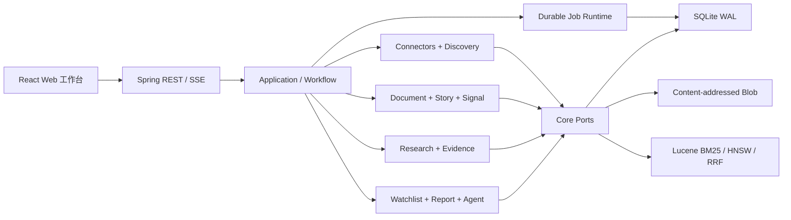
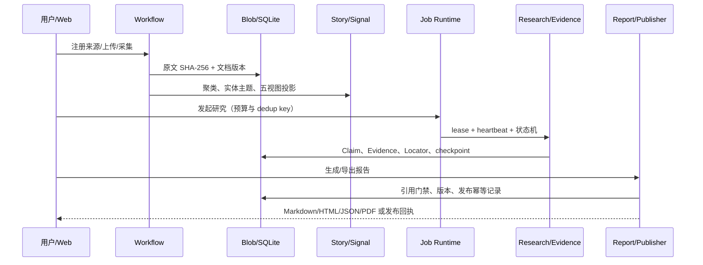

# SubtleSight 架构说明

## 边界

`core-domain` 只放稳定模型、哈希/URL 规范化、预算与状态机；`core-application` 只定义端口和用例编排。存储、搜索、Provider、Web 和 Spring 都在外层模块。`server-app` 是唯一装配根。

## 主链路

## 可靠性约束

- Job 状态转换由 Java 状态机控制；同一 dedup key 不重复入队，过期 lease 可回收，重试采用有界指数退避。
- Research 的模型输出不能控制状态迁移和预算；每阶段持久化 checkpoint，终态可重复读取。
- 原文先写临时文件、fsync、原子移动，再提交元数据。原文和证据均带 SHA-256。
- Story 聚类区分 exact duplicate、same story 和 new story；人工覆盖不被自动流程回退。
- 发布必须明确确认，且关键 Claim 必须有可定位证据；远端不确定时进入 reconcile 而非盲重发。
- `.insightpack` 使用一致性 SQLite 快照、逐项校验和；恢复时验证格式、密钥标记、zip-slip 和内容哈希。

## 安全边界

- 默认仅监听 `127.0.0.1`，采用本机直达模式，不再要求登录。
- 所有写请求同时校验 CSRF token 与 Origin；Web 工作台启动时先取得 CSRF Cookie。
- 外部 URL 逐跳做 SSRF 检查，拒绝 loopback、私网、链路本地和非 HTTP(S) 地址，并限制重定向、超时和响应体。
- Agent 只能调用注册工具；发布属于高风险动作，不能由对话绕过确认；检测到提示注入时阻断工具执行。
- 日志脱敏常见 Key、Bearer、密码字段；备份 manifest 明确 `secretsIncluded=false`。
